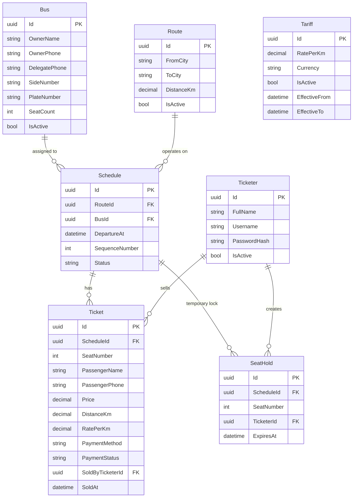

# Cross-Country Bus Ticketing System

> **Monorepo layout:** This folder is the **API** (`ticket-api` after rename). The Flutter ticketer app lives in [`../ticket-mobile`](../ticket-mobile). Close the IDE and rename `ticket` → `ticket-api` when convenient.

A multi-counter ticketing platform for cross-country bus operators. Supports bus registration, routes (with distance in km), a single active per-km tariff, trip scheduling, real-time seat availability via Server-Sent Events (SSE), and ticket sales with cash or [Chapa](https://chapa.co/) payment.

---

## Table of Contents

1. [Overview](#overview)
2. [Tech Stack](#tech-stack)
3. [Solution Structure](#solution-structure)
4. [Domain Model](#domain-model)
5. [Core Workflows](#core-workflows)
6. [API Design](#api-design)
7. [Sales Commission & Cash Distribution](#sales-commission--cash-distribution)
8. [Dashboard Reports](#dashboard-reports)
9. [Real-Time Seat Updates (SSE)](#real-time-seat-updates-sse)
10. [Payment Integration (Chapa)](#payment-integration-chapa)
11. [Authentication & Authorization](#authentication--authorization)
12. [Database](#database)
13. [Implementation Phases](#implementation-phases)
14. [Local Development Setup](#local-development-setup)
15. [Open Decisions](#open-decisions)

---

## Overview

### Actors

| Actor | Role |
|-------|------|
| **Admin** | Registers buses, routes, tariffs, and schedules |
| **Ticketer** | Sells tickets at a counter (~10 concurrent users) |
| **Passenger** | Buys a ticket (via ticketer; no direct passenger app in v1) |

### Business Rules (v1)

- Each **bus** belongs to an owner and has a fixed seat count.
- Each **route** is a city pair with a fixed **distance in kilometers** (e.g. Addis Ababa → Jimma, 346 km).
- There is **one active tariff** at a time: a **rate per km** (ETB/km). When the rate changes, the old tariff is deactivated and a new one becomes active (previous rates kept for history).
- **Ticket price** = `destinationCity.distanceFromAddisKm × activeTariff.ratePerKm` (calculated at sale time; stored on the ticket for audit). **This is the only amount the passenger pays.**
- **Stakeholder shares** are **deducted from the ticket price** (not added on top). Configured **sales parties** each receive a fixed ETB per seat; the bus owner receives the remainder (see [Sales Commission & Cash Distribution](#sales-commission--cash-distribution)).
- All routes originate from **Addis Ababa**; destination cities carry `distanceFromAddisKm`.
- Each **schedule** is a bus assigned to a route on a specific date/time with a **sequence number** (1st bus, 2nd bus, …).
- A **ticket** reserves exactly one seat on one schedule.
- A seat cannot be sold twice on the same schedule.
- Cash sales confirm immediately; online/Chapa payment is **disabled by default** (toggleable later).
- No seat holds — concurrent sales are prevented with **transactional checks** and a unique constraint on `(scheduleId, seatNumber)`.
- **National ID** is optional on tickets; use it when provided.
- **One route per bus per day** for v1; multiple routes per bus per day deferred to a later phase.

---

## Tech Stack

| Layer | Technology |
|-------|------------|
| API | **.NET 10** (ASP.NET Core Web API) |
| Mobile | **Flutter** (Android primary; iOS optional) |
| Database | **PostgreSQL** (recommended) or SQL Server |
| ORM | Entity Framework Core 10 |
| Real-time | **Server-Sent Events (SSE)** |
| Payments | **Chapa** REST API + webhooks |
| Auth | JWT Bearer tokens |
| API docs | **Scalar** + OpenAPI |
| Error handling | **ErrorOr** (typed errors → HTTP status codes) |

---

## Solution Structure

```
ticket/
├── Directory.Packages.props
├── Directory.Build.props
├── TicketSystem.sln
├── README.md
├── src/
│   ├── TicketSystem.Api/                 # Presentation: controllers, middleware, Program.cs
│   ├── TicketSystem.Application/         # Use cases: Features/, Abstractions/, Errors/
│   ├── TicketSystem.Contracts/           # DTOs (request/response)
│   ├── TicketSystem.Domain/              # Entities, enums
│   └── TicketSystem.Infrastructure/      # EF Core, configurations, auth adapters
└── tests/
    ├── TicketSystem.Api.Tests/           # Integration tests (endpoint coverage)
    └── TicketSystem.Architecture.Tests/  # Layer dependency rules (NetArchTest)
```

### Clean Architecture Layers

```
┌─────────────────────────────────────┐
│  TicketSystem.Api                   │  Controllers, Scalar docs, JWT
└──────────────┬──────────────────────┘
               │
┌──────────────▼──────────────────────┐
│  TicketSystem.Application           │  Feature services (use cases), ErrorOr
│  TicketSystem.Contracts             │  DTOs
└──────────────┬──────────────────────┘
               │ depends on abstractions only
┌──────────────▼──────────────────────┐
│  TicketSystem.Domain                │  Entities, business enums
└──────────────┬──────────────────────┘
               │ implemented by
┌──────────────▼──────────────────────┐
│  TicketSystem.Infrastructure        │  PostgreSQL, EF configurations, JWT/BCrypt
└─────────────────────────────────────┘
```

### Application structure

```
Application/
├── Abstractions/
│   ├── Authentication/     IPasswordHasher, ITokenService
│   └── Persistence/        IApplicationDbContext
├── Common/Constants/
├── Errors/                 DomainErrors (ErrorOr)
├── Features/
│   ├── Auth/               IAuthService + AuthService
│   ├── Buses/
│   ├── Routes/
│   ├── Schedules/
│   ├── Settings/
│   ├── Tariffs/
│   ├── Tickets/
│   ├── SalesParties/       Cash split + inventory on ticket sale
│   └── Reports/            Dashboard statistics
└── DependencyInjection.cs
```

### Infrastructure structure

```
Infrastructure/
├── Authentication/         BcryptPasswordHasher, JwtTokenService
├── Persistence/
│   ├── Configurations/     IEntityTypeConfiguration<T> per entity
│   ├── Migrations/         EF Core PostgreSQL migrations
│   ├── DatabaseSeeder.cs
│   └── TicketSystemDbContext.cs
└── DependencyInjection.cs
```

---

## Domain Model

### Entity Relationship (conceptual)



### Key Enums

| Enum | Values |
|------|--------|
| `ScheduleStatus` | `Scheduled`, `Boarding`, `Departed`, `Cancelled` |
| `PaymentMethod` | `Cash`, `Chapa` |
| `PaymentStatus` | `Pending`, `Paid`, `Failed`, `Refunded` |
| `TicketStatus` | `Reserved`, `Confirmed`, `Cancelled` |

### Pricing Model

Pricing is intentionally simple:

```
ticketPrice = route.distanceKm × activeTariff.ratePerKm
```

**Example:** Addis Ababa → Jimma is 346 km. Active tariff is 2.50 ETB/km.

```
346 × 2.50 = 865.00 ETB
```

### One Active Tariff

There is exactly **one active tariff** in the system at any time (not per route).

When the rate changes:

1. Deactivate the current tariff (`IsActive = false`, `EffectiveTo = now`).
2. Insert a new tariff with the new `RatePerKm` and `IsActive = true`.

At ticket sale time:

```csharp
var tariff = await db.Tariffs.SingleAsync(t => t.IsActive);
var route  = await db.Routes.FindAsync(schedule.RouteId);
var price  = route.DistanceKm * tariff.RatePerKm;
```

The ticket stores `Price`, `DistanceKm`, and `RatePerKm` at sale time so receipts stay correct even if the tariff changes later.

### Tariff History

Past tariffs remain in the database (`IsActive = false`) for reporting. No complex effective-date lookups are needed for sales — always use the single active row.

### Schedule Sequence

For a given route and departure date, multiple buses run in order:

| Route | Distance | Departure | Sequence | Bus | Price (2.50 ETB/km) |
|-------|----------|-----------|----------|-----|---------------------|
| Addis Ababa → Jimma | 346 km | 2026-06-21 06:00 | 1 | Bus A (45 seats) | 865 ETB |
| Addis Ababa → Jimma | 346 km | 2026-06-21 08:30 | 2 | Bus B (50 seats) | 865 ETB |

Ticketers query schedules **ordered by `SequenceNumber`**, then see per-seat availability.

---

## Core Workflows

### 1. Admin — Register a Bus

```
Admin → POST /api/buses
  { ownerName, ownerPhone, delegatePhone, sideNumber, plateNumber, seatCount }
```

### 2. Admin — Configure Route & Tariff

```
Admin → POST /api/routes
  { fromCity, toCity, distanceKm }

Admin → GET  /api/tariffs/active
         ← { ratePerKm, currency }   // single active rate

Admin → PUT  /api/tariffs
  { ratePerKm }                     // deactivates old, creates new active tariff
```

### 3. Admin — Create Schedule

```
Admin → POST /api/schedules
  { routeId, busId, departureAt, sequenceNumber }
```

Validation: `sequenceNumber` must be unique per `(routeId, departureDate)`.

### 4. Ticketer — View Available Buses (by sequence)

```
Ticketer → GET /api/schedules?routeId=&date=&status=Scheduled
         ← schedules with availableSeatCount, distanceKm, ratePerKm, ticketPrice, ordered by sequenceNumber

Ticketer → GET /api/schedules/{id}/seats
         ← seat map: number, status (Available | Held | Sold), ticketPrice
```

### 5. Ticketer — Sell Ticket (Cash)

```
Ticketer → GET /api/routes/seats?destinationCityId=&date=
         ← seat maps for all buses to that city on the date

Ticketer → POST /api/tickets/cash
           { scheduleId, seatNumber, passengerName, passengerPhone, nationalId? }
         ← ticket + schedule seat counts + cashBreakdown (fare, sales fee, party split)
         → cash inventory updated for each sales party
```

Double-booking is prevented by a serializable transaction and unique index on `(scheduleId, seatNumber)`.

### 6. Ticketer — Sell Ticket (Chapa)

```
Ticketer → POST /api/seats/hold        { scheduleId, seatNumber }

Ticketer → POST /api/payments/chapa/initialize
           { scheduleId, seatNumber, holdId, passengerName, passengerPhone }
         ← checkoutUrl, txRef, amount   // amount computed server-side: distanceKm × ratePerKm

Passenger pays on Chapa page / device

Chapa  → POST /api/webhooks/chapa      (server-to-server)
         → verify signature
         → confirm ticket
         → SSE broadcast: seat.sold

Ticketer polls or receives SSE: payment.confirmed
```

---

## API Design

### Admin Endpoints

| Method | Path | Description |
|--------|------|-------------|
| `POST` | `/api/buses` | Register bus |
| `GET` | `/api/buses` | List buses |
| `GET` | `/api/buses/{id}` | Get bus |
| `PUT` | `/api/buses/{id}` | Update bus |
| `POST` | `/api/routes` | Create route (includes `distanceKm`) |
| `GET` | `/api/routes` | List routes |
| `PUT` | `/api/routes/{id}` | Update route (e.g. distance) |
| `GET` | `/api/tariffs/active` | Get current per-km rate |
| `PUT` | `/api/tariffs` | Set new active rate (deactivates previous) |
| `GET` | `/api/tariffs/history` | Past per-km rates |
| `POST` | `/api/schedules` | Create schedule |
| `GET` | `/api/schedules` | List schedules (filters: route, date) |
| `PUT` | `/api/schedules/{id}` | Update / cancel schedule |
| `GET/POST` | `/api/sales-parties` | Configure sales parties (commission per seat) |
| `GET/PUT` | `/api/sales-parties/{id}` | Get / update a sales party |
| `GET` | `/api/cash-inventory` | Running balance per sales party |
| `GET` | `/api/cash-inventory/ledger?salesPartyId=` | Ledger entries (last 500) |
| `GET` | `/api/reports/dashboard?from=&to=&top=` | Full dashboard report |
| `GET` | `/api/reports/tickets-by-day?from=&to=` | Tickets sold per day |
| `GET` | `/api/reports/top-buses?from=&to=&top=` | Buses ranked by seats sold |
| `GET` | `/api/reports/top-counters?from=&to=&top=` | Ticketers ranked by sales |
| `GET` | `/api/reports/revenue-by-party?from=&to=` | Daily revenue per sales party |

### Counter (Ticketer) Endpoints

| Method | Path | Description |
|--------|------|-------------|
| `GET` | `/api/schedules/available` | Schedules with seat counts, by sequence |
| `GET` | `/api/schedules/{id}/seats` | Seat map for a schedule |
| `POST` | `/api/seats/hold` | Hold a seat (anti double-booking) |
| `DELETE` | `/api/seats/hold/{id}` | Release hold |
| `POST` | `/api/tickets/cash` | Confirm cash ticket (returns cash breakdown) |
| `GET` | `/api/tickets/{id}` | Ticket receipt |
| `GET` | `/api/tickets` | Search tickets (by date, schedule, phone) |
| `GET` | `/api/cash-inventory/tickets/{ticketId}` | Cash split for a sold ticket |
| `GET` | `/api/routes/seats?destinationCityId=&date=` | Seat maps for all buses to a city on a date |

### Real-Time

| Method | Path | Description |
|--------|------|-------------|
| `GET` | `/api/sse/schedules/{scheduleId}` | SSE stream for one schedule |
| `GET` | `/api/sse/routes/{routeId}?date=` | SSE stream for all schedules on route/date |

### Webhooks

| Method | Path | Description |
|--------|------|-------------|
| `POST` | `/api/webhooks/chapa` | Chapa payment callback |

### JSON formatting

All `decimal` values in API responses are rounded to **two decimal places** (e.g. `865.00`, `17.00`). Dates/times in responses use **Addis Ababa** local wall-clock time unless noted as UTC.

---

## Sales Commission & Cash Distribution

Each seat sold triggers an automatic **split of the ticket price** among configured **sales parties**. The passenger pays only the ticket price (`distance × ratePerKm`); every stakeholder share comes out of that single amount. Splits are stored for invoicing and tracked in a **cash inventory** ledger.

### Default split (seeded on first run)

| Party | Code | ETB / seat | Source | Notes |
|-------|------|------------|--------|-------|
| Organization (sales fee) | `ORG_SALES_FEE` | 5.00 | `SalesFee` | Deducted from ticket price |
| Platform | `PLATFORM` | 12.00 | `SalesFee` | Deducted from ticket price |
| Organization (bus levy) | `ORG_BUS_LEVY` | 3.00 | `BusOwnerIncome` | Deducted from ticket price |
| Bus owner | `BUS_OWNER` | fare − 20.00 | `BusOwnerRemainder` | Remainder after all fixed shares |

**Example** (Addis → Jimma, 346 km × 2.50 ETB/km):

| Item | Amount (ETB) |
|------|----------------|
| **Ticket price (passenger pays)** | **865.00** |
| → Organization (sales fee) | 5.00 |
| → Platform | 12.00 |
| → Organization (bus levy) | 3.00 |
| → Bus owner net | 845.00 |
| *Total distributed* | *865.00* |

Fixed shares total **20.00 ETB** per seat (`5 + 12 + 3`). The `SalesFee` source label groups organization + platform commissions for reporting; all amounts are taken from the same ticket price.

### Sales party configuration

**Sources:** `SalesFee` or `BusOwnerIncome` — used for **reporting and grouping only**. Both are deducted from the ticket price at sale time.

**Allocation types:** `FixedAmount` (fixed ETB per seat from the ticket price) or `BusOwnerRemainder` (one active party receives ticket price minus all fixed shares).

#### Create a sales party

```http
POST /api/sales-parties
Authorization: Bearer {admin-jwt}
Content-Type: application/json
```

```json
{
  "name": "Agent Commission",
  "code": "AGENT",
  "amountPerSeatEtb": 2.00,
  "source": "SalesFee",
  "allocationType": "FixedAmount",
  "sortOrder": 5
}
```

**Response `201 Created`:**

```json
{
  "id": "cccccccc-cccc-cccc-cccc-cccccccc0005",
  "name": "Agent Commission",
  "code": "AGENT",
  "amountPerSeatEtb": 2.00,
  "source": "SalesFee",
  "allocationType": "FixedAmount",
  "sortOrder": 5,
  "isActive": true,
  "createdAt": "2026-06-21T14:30:00"
}
```

#### List sales parties

```http
GET /api/sales-parties
Authorization: Bearer {admin-jwt}
```

**Response `200 OK`:**

```json
[
  {
    "id": "bbbbbbbb-bbbb-bbbb-bbbb-bbbbbbbbb001",
    "name": "Organization (Sales Fee)",
    "code": "ORG_SALES_FEE",
    "amountPerSeatEtb": 5.00,
    "source": "SalesFee",
    "allocationType": "FixedAmount",
    "sortOrder": 1,
    "isActive": true,
    "createdAt": "2026-06-21T10:00:00"
  },
  {
    "id": "bbbbbbbb-bbbb-bbbb-bbbb-bbbbbbbbb002",
    "name": "Platform",
    "code": "PLATFORM",
    "amountPerSeatEtb": 12.00,
    "source": "SalesFee",
    "allocationType": "FixedAmount",
    "sortOrder": 2,
    "isActive": true,
    "createdAt": "2026-06-21T10:00:00"
  }
]
```

### Cash ticket sale (with breakdown)

```http
POST /api/tickets/cash
Authorization: Bearer {ticketer-jwt}
Content-Type: application/json
```

**Request:**

```json
{
  "scheduleId": "a1a1a1a1-a1a1-a1a1-a1a1-a1a1a1a1a1a1",
  "seatNumber": 4,
  "passengerName": "Abebe Kebede",
  "passengerPhone": "0911223344",
  "nationalId": null
}
```

**Response `201 Created`:**

```json
{
  "ticket": {
    "id": "d1d1d1d1-d1d1-d1d1-d1d1-d1d1d1d1d1d1",
    "scheduleId": "a1a1a1a1-a1a1-a1a1-a1a1-a1a1a1a1a1a1",
    "fromCity": "Addis Ababa",
    "toCity": "Jimma",
    "departureAt": "2026-06-21T12:00:00",
    "sequenceNumber": 1,
    "plateNumber": "AA-12345",
    "seatNumber": 4,
    "passengerName": "Abebe Kebede",
    "passengerPhone": "0911223344",
    "nationalId": null,
    "price": 865.00,
    "distanceKm": 346.00,
    "ratePerKm": 2.50,
    "paymentMethod": "Cash",
    "soldBy": "Counter Ticketer",
    "soldAt": "2026-06-21T11:45:00"
  },
  "scheduleSoldSeatCount": 1,
  "scheduleAvailableSeatCount": 44,
  "scheduleIsFullySold": false,
  "cashBreakdown": {
    "ticketFareEtb": 865.00,
    "salesFeeTotalEtb": 17.00,
    "totalCashCollectedEtb": 865.00,
    "distributions": [
      {
        "id": "e1e1e1e1-e1e1-e1e1-e1e1-e1e1e1e1e1e1",
        "ticketId": "d1d1d1d1-d1d1-d1d1-d1d1-d1d1d1d1d1d1",
        "partyCode": "ORG_SALES_FEE",
        "partyName": "Organization (Sales Fee)",
        "source": "SalesFee",
        "allocationType": "FixedAmount",
        "amountEtb": 5.00,
        "createdAt": "2026-06-21T11:45:00"
      },
      {
        "id": "e2e2e2e2-e2e2-e2e2-e2e2-e2e2e2e2e2e2",
        "ticketId": "d1d1d1d1-d1d1-d1d1-d1d1-d1d1d1d1d1d1",
        "partyCode": "PLATFORM",
        "partyName": "Platform",
        "source": "SalesFee",
        "allocationType": "FixedAmount",
        "amountEtb": 12.00,
        "createdAt": "2026-06-21T11:45:00"
      },
      {
        "id": "e3e3e3e3-e3e3-e3e3-e3e3-e3e3e3e3e3e3",
        "ticketId": "d1d1d1d1-d1d1-d1d1-d1d1-d1d1d1d1d1d1",
        "partyCode": "ORG_BUS_LEVY",
        "partyName": "Organization (Bus Levy)",
        "source": "BusOwnerIncome",
        "allocationType": "FixedAmount",
        "amountEtb": 3.00,
        "createdAt": "2026-06-21T11:45:00"
      },
      {
        "id": "e4e4e4e4-e4e4-e4e4-e4e4-e4e4e4e4e4e4",
        "ticketId": "d1d1d1d1-d1d1-d1d1-d1d1-d1d1d1d1d1d1",
        "partyCode": "BUS_OWNER",
        "partyName": "Bus Owner",
        "source": "BusOwnerIncome",
        "allocationType": "BusOwnerRemainder",
        "amountEtb": 845.00,
        "createdAt": "2026-06-21T11:45:00"
      }
    ]
  }
}
```

`salesFeeTotalEtb` is the portion of the ticket price allocated to `SalesFee`-source parties (5 + 12 = 17.00) — **not** an extra charge. `totalCashCollectedEtb` equals `ticketFareEtb` (what the passenger paid).

On each sale the API also writes `TicketSaleDistribution` rows, `CashLedgerEntry` credits, and updates `CashInventory` balances in the same database transaction as the ticket.

### Cash inventory

```http
GET /api/cash-inventory
Authorization: Bearer {admin-jwt}
```

**Response `200 OK`:**

```json
[
  {
    "salesPartyId": "bbbbbbbb-bbbb-bbbb-bbbb-bbbbbbbbb002",
    "partyCode": "PLATFORM",
    "partyName": "Platform",
    "source": "SalesFee",
    "balanceEtb": 120.00,
    "updatedAt": "2026-06-21T15:00:00"
  },
  {
    "salesPartyId": "bbbbbbbb-bbbb-bbbb-bbbb-bbbbbbbbb001",
    "partyCode": "ORG_SALES_FEE",
    "partyName": "Organization (Sales Fee)",
    "source": "SalesFee",
    "balanceEtb": 50.00,
    "updatedAt": "2026-06-21T15:00:00"
  }
]
```

#### Ledger for a party

```http
GET /api/cash-inventory/ledger?salesPartyId=bbbbbbbb-bbbb-bbbb-bbbb-bbbbbbbbb002
Authorization: Bearer {admin-jwt}
```

**Response `200 OK`:**

```json
[
  {
    "id": "f1f1f1f1-f1f1-f1f1-f1f1-f1f1f1f1f1f1",
    "salesPartyId": "bbbbbbbb-bbbb-bbbb-bbbb-bbbbbbbbb002",
    "partyCode": "PLATFORM",
    "partyName": "Platform",
    "ticketId": "d1d1d1d1-d1d1-d1d1-d1d1-d1d1d1d1d1d1",
    "entryType": "TicketSaleCredit",
    "amountEtb": 12.00,
    "balanceAfterEtb": 120.00,
    "occurredAt": "2026-06-21T11:45:00"
  }
]
```

---

## Dashboard Reports

Admin-only reporting endpoints for operational dashboards. All dates use the **Addis Ababa** calendar. Statistics are based on **`SoldAt`** (when the ticket was sold at the counter).

**Query parameters (all report endpoints):**

| Parameter | Default | Description |
|-----------|---------|-------------|
| `from` | 30 days before `to` | Start date (`yyyy-MM-dd`) |
| `to` | Today (Addis) | End date (`yyyy-MM-dd`) |
| `top` | `10` | Max rows for ranked lists (dashboard, top-buses, top-counters; max 50) |

### Full dashboard

```http
GET /api/reports/dashboard?from=2026-06-01&to=2026-06-21&top=10
Authorization: Bearer {admin-jwt}
```

**Response `200 OK`:**

```json
{
  "from": "2026-06-01",
  "to": "2026-06-21",
  "summary": {
    "totalTicketsSold": 42,
    "totalTicketFareEtb": 36330.00,
    "totalSalesFeeEtb": 714.00,
    "totalCashCollectedEtb": 36330.00,
    "partyTotals": [
      {
        "partyCode": "BUS_OWNER",
        "partyName": "Bus Owner",
        "source": "BusOwnerIncome",
        "amountEtb": 36204.00
      },
      {
        "partyCode": "ORG_BUS_LEVY",
        "partyName": "Organization (Bus Levy)",
        "source": "BusOwnerIncome",
        "amountEtb": 126.00
      },
      {
        "partyCode": "ORG_SALES_FEE",
        "partyName": "Organization (Sales Fee)",
        "source": "SalesFee",
        "amountEtb": 210.00
      },
      {
        "partyCode": "PLATFORM",
        "partyName": "Platform",
        "source": "SalesFee",
        "amountEtb": 504.00
      }
    ]
  },
  "ticketsByDay": [
    {
      "date": "2026-06-20",
      "ticketCount": 18,
      "ticketFareEtb": 15570.00,
      "salesFeeEtb": 306.00,
      "totalCashCollectedEtb": 15570.00
    },
    {
      "date": "2026-06-21",
      "ticketCount": 24,
      "ticketFareEtb": 20760.00,
      "salesFeeEtb": 408.00,
      "totalCashCollectedEtb": 20760.00
    }
  ],
  "topBuses": [
    {
      "busId": "b1b1b1b1-b1b1-b1b1-b1b1-b1b1b1b1b1b1",
      "plateNumber": "AA-50001",
      "sideNumber": "S-50001",
      "ticketsSold": 15,
      "ticketFareEtb": 12975.00
    }
  ],
  "topCounters": [
    {
      "userId": "22222222-2222-2222-2222-222222222222",
      "userName": "Counter Ticketer",
      "ticketsSold": 28,
      "ticketFareEtb": 24220.00,
      "salesFeeEtb": 476.00,
      "totalCashCollectedEtb": 24220.00
    }
  ],
  "revenueByPartyByDay": [
    {
      "date": "2026-06-21",
      "parties": [
        {
          "partyCode": "BUS_OWNER",
          "partyName": "Bus Owner",
          "source": "BusOwnerIncome",
          "amountEtb": 20688.00
        },
        {
          "partyCode": "ORG_BUS_LEVY",
          "partyName": "Organization (Bus Levy)",
          "source": "BusOwnerIncome",
          "amountEtb": 72.00
        },
        {
          "partyCode": "ORG_SALES_FEE",
          "partyName": "Organization (Sales Fee)",
          "source": "SalesFee",
          "amountEtb": 120.00
        },
        {
          "partyCode": "PLATFORM",
          "partyName": "Platform",
          "source": "SalesFee",
          "amountEtb": 288.00
        }
      ]
    }
  ]
}
```

### Individual report endpoints

| Endpoint | Returns |
|----------|---------|
| `GET /api/reports/tickets-by-day` | Daily ticket counts and fare / fee totals |
| `GET /api/reports/top-buses` | Buses ranked by seats sold in the period |
| `GET /api/reports/top-counters` | Ticketers ranked by tickets sold |
| `GET /api/reports/revenue-by-party` | Per-day revenue broken down by sales party |

**Example — tickets by day:**

```http
GET /api/reports/tickets-by-day?from=2026-06-21&to=2026-06-21
```

```json
[
  {
    "date": "2026-06-21",
    "ticketCount": 3,
    "ticketFareEtb": 2595.00,
    "salesFeeEtb": 51.00,
    "totalCashCollectedEtb": 2595.00
  }
]
```

---

## Real-Time Seat Updates (SSE)

### Why SSE (not WebSockets)

- One-way server → client updates are sufficient for seat maps.
- Simpler to scale behind reverse proxies.
- Works well with ~10 concurrent ticketer connections per schedule.
- Automatic reconnect built into EventSource clients.

### Connection Model

Each ticketer opens one SSE connection per active schedule they are viewing:

```
GET /api/sse/schedules/{scheduleId}
Authorization: Bearer {jwt}
Accept: text/event-stream
```

### Event Types

| Event | When | Payload |
|-------|------|---------|
| `connected` | On connect | `{ scheduleId, serverTime }` |
| `seat.held` | Seat temporarily locked | `{ seatNumber, heldBy, expiresAt }` |
| `seat.released` | Hold expired or cancelled | `{ seatNumber }` |
| `seat.sold` | Ticket confirmed | `{ seatNumber, ticketId }` |
| `schedule.updated` | Status change | `{ status }` |
| `payment.confirmed` | Chapa success | `{ ticketId, txRef }` |
| `heartbeat` | Every 30s | `{ serverTime }` |

Example:

```
event: seat.sold
data: {"scheduleId":"...","seatNumber":12,"ticketId":"..."}

event: heartbeat
data: {"serverTime":"2026-06-21T10:00:00Z"}
```

### Double-Booking Prevention

Use a **database transaction + unique constraint** on `(ScheduleId, SeatNumber)` for confirmed tickets, plus a `SeatHold` table for in-progress sales:

1. **Hold**: Insert into `SeatHolds` if seat is not sold and not held (or held but expired).
2. **Confirm**: Within transaction, verify hold belongs to ticketer and is not expired → insert `Ticket` → delete hold.
3. **Broadcast**: Push SSE event to all subscribers for that schedule.

Background job (or hosted service) expires holds every 30 seconds and emits `seat.released`.

Unique indexes:

```sql
UNIQUE (ScheduleId, SeatNumber) ON Tickets WHERE Status = 'Confirmed'
UNIQUE (ScheduleId, SeatNumber) ON SeatHolds WHERE ExpiresAt > NOW()
```

---

## Payment Integration (Chapa)

### Flow

1. API calls Chapa **Initialize Transaction** with amount, currency (ETB), tx_ref, callback URL.
2. Return `checkout_url` to Flutter app (open in WebView or external browser).
3. Chapa sends webhook on success/failure.
4. API verifies webhook signature, idempotently confirms ticket.

### Configuration (appsettings)

```json
{
  "Chapa": {
    "SecretKey": "",
    "PublicKey": "",
    "WebhookSecret": "",
    "BaseUrl": "https://api.chapa.co/v1",
    "CallbackUrl": "https://your-api/api/webhooks/chapa"
  }
}
```

### Idempotency

Store `ChapaTxRef` on payment records. Webhook handler checks if ticket already confirmed before creating duplicate.

---

## Authentication & Authorization

| Role | Permissions |
|------|-------------|
| `Admin` | Full CRUD on buses, routes, tariffs, schedules, sales parties, reports, cash inventory |
| `Ticketer` | View schedules/seats, sell tickets, view ticket cash breakdown |

JWT issued via:

```
POST /api/auth/login   { username, password }
→ { accessToken, expiresIn, role }
```

**Request:**

```json
{
  "username": "admin",
  "password": "admin123"
}
```

**Response `200 OK`:**

```json
{
  "accessToken": "eyJhbGciOiJIUzI1NiIsInR5cCI6IkpXVCJ9...",
  "expiresIn": 28800,
  "role": "Admin",
  "fullName": "System Admin"
}
```

Default seeded users (development): `admin` / `admin123`, `ticketer` / `ticketer123`.

Flutter stores token securely (`flutter_secure_storage`).

---

## Database

**Recommended: PostgreSQL 16+**

| Table | Purpose |
|-------|---------|
| `Buses` | Registered vehicles |
| `Cities` | Cities with distance from Addis Ababa (km) |
| `Routes` | Addis Ababa → destination city pairs |
| `Tariffs` | Global per-km rate (one active at a time) |
| `Schedules` | Bus + route + departure + sequence |
| `Tickets` | Sold seats (stores fare, distance, rate at sale time) |
| `SalesParties` | Configurable commission parties (ETB per seat) |
| `TicketSaleDistributions` | Per-ticket cash split snapshot (for invoicing) |
| `CashInventories` | Running balance per sales party |
| `CashLedgerEntries` | Audit trail of inventory credits/debits |
| `AspNetUsers` / `AspNetRoles` | Identity users (Admin, Ticketer) |
| `AuditLogs` | Entity change audit trail |
| `AppSettings` | Feature flags (e.g. online payment enabled) |
| `SeatHolds` | *(planned)* Temporary reservations |
| `Payments` | *(planned)* Chapa transaction records |

Migrations managed with EF Core (`dotnet ef migrations add` / `dotnet ef database update`).

Key migrations: `InitialCreate`, `AddCities`, `AddSalesPartiesAndCashInventory`.

---

## Implementation Phases

### Phase 0 — Planning

- [x] Domain model and README
- [x] PostgreSQL selected
- [x] Pricing model: distance × per-km rate, one active tariff

### Phase 1 — .NET API Foundation ✅

- [x] Solution: Api, Domain, Application, Contracts, Infrastructure
- [x] EF Core + PostgreSQL, migrations, database seeder
- [x] ASP.NET Core Identity (Admin + Ticketer roles), JWT auth
- [x] Cities (Addis Ababa origin, distance from Addis)
- [x] Admin CRUD: buses, routes, tariffs, schedules
- [x] Audit logging interceptor, Addis Ababa business timezone (Noda Time)
- [x] Scalar + OpenAPI docs
- [x] Architecture + API integration tests (64 tests)

### Phase 2 — Ticketing (partial) 🔄

- [x] Seat availability on schedules and route-level seat maps
- [x] Cash ticket sale with transactional double-booking prevention
- [x] Sales party commission split + cash inventory on each sale
- [x] Dashboard reports (tickets/day, top buses, top counters, party revenue)
- [ ] Seat hold / release with expiry
- [ ] SSE endpoint for live seat updates

### Phase 3 — Chapa Payments

- [ ] Chapa initialize + webhook handler
- [ ] Payment entity and status tracking
- [ ] Pending → confirmed ticket flow
- [ ] Webhook signature verification

### Phase 4 — Flutter Ticketer App

- [ ] Project scaffold (`ticket_counter`)
- [ ] Login, route/date picker, schedule list, seat map
- [ ] Cash sale flow with cash breakdown on receipt
- [ ] SSE client for live updates
- [ ] Chapa flow (WebView checkout)

### Phase 5 — Hardening

- [ ] Load test (~10 concurrent ticketers, same schedule)
- [ ] Invoicing from cash ledger / party totals
- [ ] Deployment guide (API + DB)

---

## Local Development Setup

### Prerequisites

| Tool | Version | Notes |
|------|---------|-------|
| .NET SDK | 10.x | Verified: `dotnet --version` → 10.0.300 |
| PostgreSQL | 16+ | Or Docker: `docker run -d -p 5432:5432 -e POSTGRES_PASSWORD=postgres postgres:16` |
| Flutter SDK | 3.x stable | **Not yet on PATH** — install from [flutter.dev](https://docs.flutter.dev/get-started/install) |
| IDE | VS / Rider / VS Code | For API and Flutter |

### API

```bash
cd src/TicketSystem.Api
dotnet run
# Scalar API docs: https://localhost:5001/scalar/v1
```

Apply migrations and seed data (runs automatically on startup in Development):

```bash
dotnet ef database update --project src/TicketSystem.Infrastructure --startup-project src/TicketSystem.Api
```

Run tests:

```bash
dotnet test
```

### Flutter (after Phase 4)

```bash
cd mobile/ticket_counter
flutter pub get
flutter run
```

### Environment Variables

```bash
ConnectionStrings__Default=Host=localhost;Database=ticket_system_dev;Username=postgres;Password=postgres
Jwt__Secret=your-256-bit-secret
BusinessTimeZone__Id=Africa/Addis_Ababa
Chapa__SecretKey=CHASECK_TEST-...
```

---

## Open Decisions

| # | Question | Recommendation | Status |
|---|----------|----------------|--------|
| 1 | Database: PostgreSQL or SQL Server? | PostgreSQL | **Done** |
| 2 | Seat numbering: 1..N or custom layout? | Simple 1..N for v1 | **Done** |
| 3 | Hold duration before auto-release? | 5 minutes | Open (holds not implemented) |
| 4 | Currency? | ETB | **Done** |
| 5 | Passenger ID required (national ID)? | Optional | **Done** |
| 6 | Admin UI needed or API-only? | API + Scalar for v1 | **Done** |
| 7 | Chapa: test keys available? | Needed for Phase 3 | Open |
| 8 | Same-day multiple routes per bus allowed? | Yes, if schedules don't overlap | Open |
| 9 | Pricing: distance × per-km rate, one active tariff | Confirmed | **Done** |
| 10 | Stakeholder split from ticket price + cash inventory | Configurable sales parties | **Done** |
| 11 | Dashboard reports for admin | Tickets/day, top buses/counters, party revenue | **Done** |

---

## Next Steps

1. **Seat holds + SSE** — live seat map updates at counters.
2. **Chapa payments** — online checkout when enabled in settings.
3. **Flutter ticketer app** — mobile counter UI against this API.
4. **Invoicing** — generate party statements from `CashLedgerEntries` / report totals.
